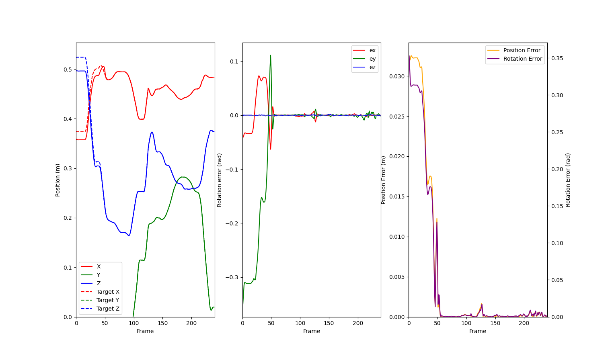
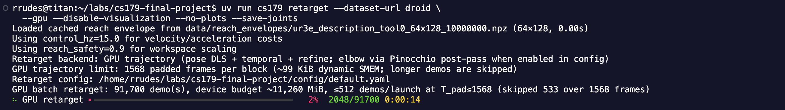
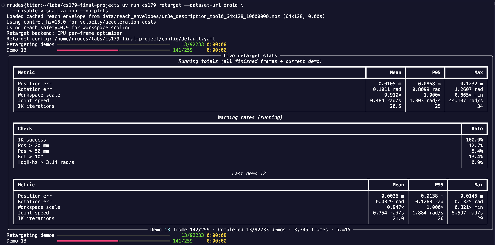
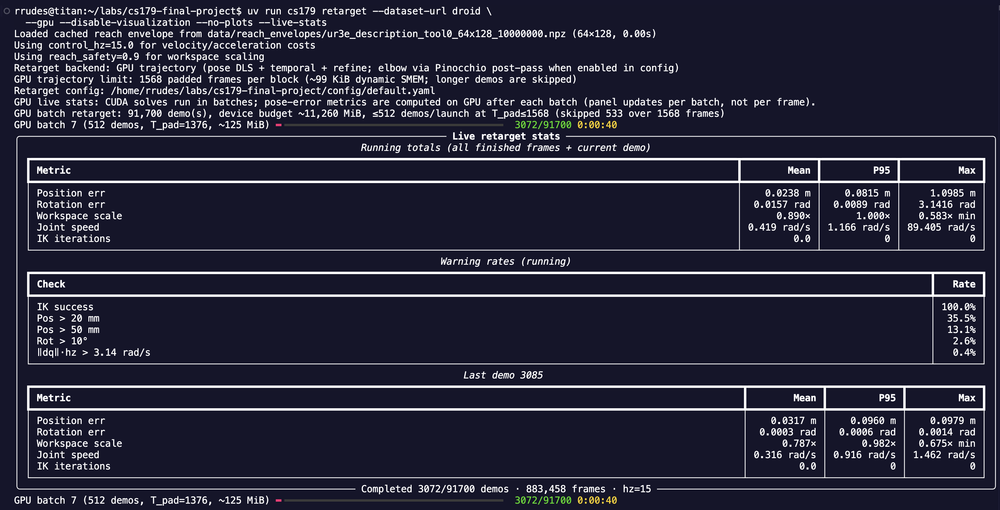

# CS179 — DROID retargeting

Download robot proprioception from RLDS (DROID), build a directional reach envelope, and retarget demonstrations onto a **UR3e** (default). DROID was recorded on Franka Panda arms; Panda is used only for elbow-side hints during retargeting.

Python **3.12+**, dependencies and CLI via [uv](https://docs.astral.sh/uv/).

## Prerequisites

- [uv](https://docs.astral.sh/uv/)
- CMake **3.18+** and a **C++17** compiler
- Optional: CUDA `nvcc` (required for GPU-accelerated motion retargeting)

## Install

```bash
git clone <repo-url>
cd cs179_final_project
uv sync --dev
```

Build the native extension. If you have CUDA available, build with GPU acceleration:

```bash
./scripts/build_native.sh
```

Otherwise, build the CPU/loader-only extension (no CUDA/GPU required):

```bash
./scripts/build_loader.sh
```

This produces `src/cs179/_native*.so`. If you change C++ files, CUDA kernels, or Python bindings, rebuild using the appropriate script.

## Quick start

**1. Download** DROID proprio to disk (default: 100-demo subset):

```bash
uv run cs179 download --dataset-url DROID_100
```

For the full DROID dataset (cache at `data/droid/`):

```bash
uv run cs179 download --dataset-url DROID
```

Cache layout: `data/droid_100/` with sharded `.npy` observations and `metadata/metadata.json`.

**Alternative:** You can skip `cs179 download` and use the pre-cached DROID subset from [Kaggle — droid-motion-data](https://www.kaggle.com/datasets/ryanrudes/droid-motion-data). Extract it under `data/droid/` so the layout matches the full dataset cache.

**2. Retarget and visualize** cached DROID demos onto UR3e.

Retarget one demo with live Meshcat playback and per-demo matplotlib error plots (open the Meshcat URL printed in the terminal, usually [http://127.0.0.1:7000/static/](http://127.0.0.1:7000/static/)):

```bash
uv run cs179 retarget --dataset-url droid --start-demo 0 --end-demo 1
```



For the 100-demo subset instead, use `--dataset-url DROID_100`.

**Mass retarget with Rich progress** (headless, no Meshcat or matplotlib):

GPU batch retarget over the full dataset (maximum throughput; Rich progress bar per GPU launch batch):

```bash
uv run cs179 retarget --dataset-url droid \
  --gpu --disable-visualization --no-plots --save-joints
```



CPU retarget with a live Rich stats panel (per-demo/frame progress plus running IK and error-rate summaries; enabled automatically when headless without `--gpu`):

```bash
uv run cs179 retarget --dataset-url droid \
  --disable-visualization --no-plots
```



On GPU, add `--live-stats` for the same Rich live panel (running error rates, per-demo frame progress) while keeping batched GPU launches:

```bash
uv run cs179 retarget --dataset-url droid \
  --gpu --disable-visualization --no-plots --live-stats
```



The panel updates after each GPU batch solves a group of demos; pose-error metrics are also computed on GPU (one `evaluate_trajectories_gpu` launch per batch), so `--live-stats` adds negligible overhead.

Benchmark CPU vs GPU throughput with Rich result tables (produces the numbers in [Performance Benchmarks](#performance-benchmarks) below):

```bash
uv run scripts/benchmark_cpu_gpu.py --dataset droid
uv run scripts/benchmark_cpu_gpu.py --dataset droid --cpu-limit 50 --gpu-limit 1000
```

Replay a saved demo in Meshcat (forward port 7000 when running over SSH):

```bash
ssh -L 7000:localhost:7000 -L 6000:localhost:6000 user@host
uv run cs179 retarget replay --dataset-url droid --demo 0 --loop --compare-source
```
Adding the `--compare-source` flag places the original robot + motion side by side with the new robot executing the retargeted motion.

[<video src="assets/compare_source.mov" width="100%"></video>](https://github.com/user-attachments/assets/eadbf8a5-668b-479d-a1cc-753fa19465c3)


First run builds or loads a reach envelope under `data/reach_envelopes/`. Defaults: **64×128** bins, **10M** FK samples. Use smaller values for a quick try:

```bash
uv run cs179 retarget --dataset-url DROID_100 \
  --reach-n-theta 64 --reach-n-phi 128 --reach-n-samples 1000000
```

**3. Config** — weights, IK, and solver settings in `[config/default.yaml](config/default.yaml)`. Override with `--config path/to.yaml`.

## CLI overview

```bash
uv run cs179 --help
```


| Command                          | Purpose                                                                |
| -------------------------------- | ---------------------------------------------------------------------- |
| `cs179 download`                 | Stream RLDS episodes to local `.npy` shards                            |
| `cs179 retarget`                 | Map cached Cartesian demos onto `--robot` (default `ur3e_description`) |
| `cs179 reach-envelope build`     | Precompute reach envelope NPZ only                                     |
| `cs179 reach-envelope visualize` | Viser viewer for envelope + optional robot mesh                        |


Common retarget flags:


| Flag                          | Default             | Notes                                                            |
| ----------------------------- | ------------------- | ---------------------------------------------------------------- |
| `--robot`                     | `ur3e_description`  | Target robot (reach + IK)                                        |
| `--panda`                     | `panda_description` | Source arm for elbow hints                                       |
| `--data-dir`                  | `data`              | Base dir; dataset name appended                                  |
| `--start-demo` / `--end-demo` | `0` / all           | Demo index range                                                 |
| `--reach-safety`              | `0.9`               | Scale Cartesian targets into workspace                           |
| `--gpu`                       | off                 | Batched CUDA retarget (CUDA build required)                      |
| `--live-stats`                | off                 | Rich live stats panel (headless); with `--gpu`, keeps batched launches |
| `--no-native`                 | off                 | Force Python reach + SciPy retarget                              |
| `--reach-force-rebuild`       | off                 | Ignore cached envelope NPZ                                       |


## Reach envelope only

```bash
uv run cs179 reach-envelope build --robot ur3e_description
uv run cs179 reach-envelope visualize --robot ur3e_description
```

Caches: `data/reach_envelopes/{robot}_{frame}_{n_theta}x{n_phi}_{n_samples}.npz`.

## Expected Results

A successful retargeting run should:

- Download or load cached DROID proprioception data from `data/droid/` or `data/droid_100/`.
- Build or reuse a directional reach envelope under `data/reach_envelopes/`.
- Retarget Franka Panda demonstrations onto the default **UR3e** target robot.
- Produce joint trajectories that preserve the source end-effector motion while scaling unreachable Cartesian targets into the UR3e workspace.
- Optionally save retargeted joint trajectories when `--save-joints` is enabled.
- Show Meshcat playback and matplotlib pose-error plots unless running headless with `--disable-visualization --no-plots`.

For quality-tuned GPU defaults, typical DROID retargeting errors are expected to be approximately:

| Backend Reference | Mean Position Error | Mean Rotation Error |
| ----------------- | ------------------- | ------------------- |
| GPU CUDA          | ~0.02 m             | ~0.02 rad           |
| CPU NLopt         | ~0.005 m            | ~0.05 rad           |

On a CUDA-capable workstation, GPU retargeting should be much faster than the CPU solver while preserving usable pose accuracy. Exact throughput depends on GPU model, batch size, demo lengths, and whether visualization or plotting is enabled.

## Actual Results

### Performance Benchmarks

Reproduce these numbers with:

```bash
uv run scripts/benchmark_cpu_gpu.py --dataset droid
```

Motion retargeting can be run on CPU or GPU. Below is an apples-to-apples throughput comparison of retargeting performance, comparing the highly optimized C++ native NLopt solver (running on all available CPU cores) to the batched CUDA implementation on an Intel Xeon E5-2640 v3 (16 threads) and an NVIDIA RTX A5000:

| Backend         | Hardware Utilized | Solver Throughput (frames/sec) | Speedup   |
| --------------- | ----------------- | ------------------------------ | --------- |
| C++ CPU (NLopt) | 16 Cores          | ~710                           | 1x        |
| GPU CUDA (Pure) | NVIDIA RTX A5000  | ~62,789                        | **88.4x** |

Streaming the first 2,000 demos (~577k frames) through the full pipeline—data loading, Cartesian scaling, GPU multi-start seeding, and solve—sustains **~57,900 pipeline frames/sec** (~200 demos/sec), retargeting the complete ~2.8M-frame dataset in under a minute.

> **Quality-tuned defaults.** The GPU solver now runs 30 pose + 4 temporal + 20 refine Jacobi sweeps (previously 6+4+4), seeds every demo with a GPU multi-start frame-0 IK pass, weights the DLS translation/rotation rows by the config error units, and uses the exact SE(3) `log6` pose error. This cut mean rotation error from ~1.4 rad to ~0.02 rad and mean position error from ~0.12 m to ~0.02 m on DROID demos (CPU NLopt reference: ~0.005 m / ~0.05 rad), at the cost of solver throughput (previously ~929k frames/sec at the under-converged settings). Per-frame pose-error metrics (`--live-stats`) are computed by a dedicated GPU kernel at ~1.5M frames/sec.

> **Note:** The GPU implementation avoids iterative Python/C++ overhead by running Jacobi projected gradient descent completely inside shared memory. To maintain maximum throughput during dataset generation, run headless with `--disable-visualization --no-plots`, which skips Meshcat playback and matplotlib plots.

### Hardware-level GPU Profiling (Nsight Compute)

To profile the low-level execution characteristics of the CUDA retargeting kernel, we run a hardware-level profiling script using NVIDIA Nsight Compute (`ncu`). This profiling isolates the `retarget_trajectory_kernel` and measures hardware metrics like achieved occupancy, SM throughput, and shared memory utilization.

You can run this profiling script using:

```bash
uv run scripts/benchmark_nsight.py             # single 10-demo batch
uv run scripts/benchmark_nsight.py --demos 100 # custom batch size
uv run scripts/benchmark_nsight.py --sweep     # 10/100/1000-demo scaling table
```

Hardware metrics captured on an NVIDIA RTX A5000 across batch sizes (`--sweep`), profiled at the previous default iteration counts (6 pose + 4 temporal + 4 refine; kernel durations scale roughly linearly with sweep count):

| Metric                        | 10 demos  | 100 demos | 1000 demos |
| ----------------------------- | --------- | --------- | ---------- |
| Total Kernel Duration         | 12.34 ms  | 16.27 ms  | 98.41 ms   |
| Compute (SM) Throughput       | 2.92%     | 26.37%    | 44.30%     |
| Achieved Occupancy            | 16.67%    | 16.67%    | 16.66%     |
| Shared Mem Throughput         | 0.11%     | 0.97%     | 1.64%      |
| Registers Per Thread          | 116       | 116       | 116        |
| Dynamic Shared Memory / Block | 42.25 KiB | 58.25 KiB | 96.25 KiB  |

*Note: The dynamic shared memory allocation keeps the entire solver state (joint trajectories and kinematics cache) on-chip within L1/Shared Memory, minimizing latency during iterative projected gradient descent steps. It grows with batch size because all demos in a launch are padded to the longest trajectory in the batch, and larger batches include longer demos.*

**Why the hardware utilization numbers are low (and expected).** These metrics describe how much of the GPU's theoretical capacity the kernel uses, not how fast the pipeline runs—the two are decoupled here by design:

- **Small batches underfeed the GPU.** The kernel launches one block per demo, so a 10-demo profile occupies only ~10 of the RTX A5000's 64 SMs and most of the GPU sits idle. The sweep confirms this directly: SM throughput climbs from 2.92% at 10 demos to 44.30% at 1000 demos with the same kernel, while a 100× larger batch takes only ~8× longer to solve. The low utilization at small batches is underfeeding, not kernel inefficiency.
- **Shared memory limits residency.** With 42–96 KiB of dynamic shared memory per block, only a few blocks fit per SM, capping achieved occupancy at 16.67% regardless of batch size. This is a deliberate latency-vs-occupancy trade: keeping all solver state on-chip avoids global memory traffic and synchronization inside the iterative solve loop.
- **High register pressure.** The generated FK/Jacobian device code holds many intermediates in registers (116/thread), further reducing resident warps. The alternative—spilling to local memory—would be slower.
- **Workload shape.** Each block runs a small, structured optimizer (fixed-size vector math, limit projection, block-level sync), not a dense arithmetic workload, so low shared-memory and SM throughput percentages are normal even for a well-tuned kernel.

The meaningful end-to-end metric is the throughput table above: at the current quality-tuned defaults (~58k pipeline frames/sec), the full ~2.8M-frame dataset retargets in under a minute end to end — versus over an hour for the 16-core CPU solver.

### Custom CUDA Kernels and Kinematics Codegen

The performance of the GPU backend relies on two key architectural components:

1. **Custom GPU Solver Kernel (`retarget_trajectory_kernel`)**: Implemented in [cuda/src/retarget_gpu.cu](cuda/src/retarget_gpu.cu). This kernel performs batched, warp-level projected gradient descent completely within GPU shared memory. By storing the active trajectory, joint limits, optimization weights, and kinematics cache on-chip, it completely avoids global memory latency and host-to-device synchronization overhead during iterative projection/solve loops.
2. **Forward Kinematics & Analytical Jacobian Codegen**: Evaluating forward kinematics (FK) and analytical local spatial Jacobians in parallel at 15 Hz is computationally intensive. To optimize this, highly optimized, **register-allocated, operation-minimized C++ kinematics kernels** are precomputed symbolically using a **separate custom generation codebase**. The resulting C++ kernels (committed under the [kernels/](kernels/) directory, e.g., for the UR3e tool0 frame) are translated into float32 CUDA device inline functions via our generator script [scripts/generate_device_fk.py](scripts/generate_device_fk.py). These generated device headers ([cuda/include/generated/ur3e_tool0_fk_device.cuh](cuda/include/generated/ur3e_tool0_fk_device.cuh)) are compile-time inlined within the CUDA kernel, allowing ultra-fast, instruction-minimized joint-to-Cartesian evaluations per warp thread.

## Tests

```bash
uv run pytest
```

Loader tests expect `data/droid_100` from `cs179 download` or the [Kaggle cache](https://www.kaggle.com/datasets/ryanrudes/droid-motion-data). Native retarget tests need `./scripts/build_loader.sh`.

## Project layout

```text
src/cli.py              # Typer entry point (cs179)
src/rlds/               # RLDS download + cache loader
src/retarget/           # Retargeting + stats/plots
src/reachability/       # Directional reach envelope
cpp/                    # Native reach + retarget (Pinocchio, NLopt)
config/default.yaml     # Retarget cost weights and solver
data/                   # Downloaded datasets and envelope caches (gitignored)
```

## Notes

- **Intended pipeline:** DROID (Panda) demos → **UR3e** via `--robot ur3e_description`. Retargeting onto Panda (`--robot panda_description`) is supported but not the main use case.
- After editing `src/cli.py` or `src/cli_reach_envelope.py`, reinstall if the CLI looks stale: `uv pip install -e . --force-reinstall --no-deps`.
- Examples: `[examples/README.md](examples/README.md)`.

